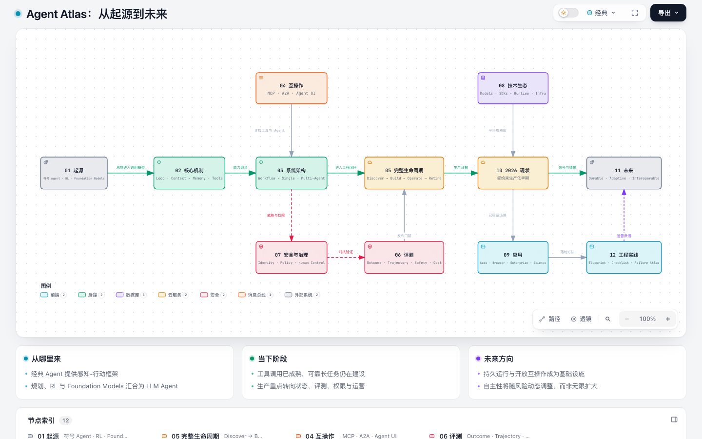

# Agent Atlas

[](./knowledge/10-current-state/2026-snapshot.md)
[](./knowledge/00-orientation/glossary.md)
[](./LICENSE)

[](./artifacts/agent-knowledge-map.html)

> 一张从智能体思想源流，到 2026 年工程现状，再到未来 3-5 年开放问题的可审计知识地图。

**[打开交互知识地图](./artifacts/agent-knowledge-map.html)** · **[下载《Agent Atlas》PDF 小书](./artifacts/agent-atlas-book.zh-CN.pdf)** · **[进入知识树](./knowledge/README.md)**

## 三条阅读主线

| 主线 | 回答的问题 | 入口 |
|---|---|---|
| 从哪里来 | Agent 为什么会从符号智能、规划、强化学习演进到 LLM Agent？ | [历史与里程碑](./knowledge/01-origins/README.md) |
| 当下在哪里 | 可靠 Agent 由哪些能力、架构、协议和工程生命周期组成？ | [核心机制](./knowledge/02-core-mechanics/README.md) · [2026 快照](./knowledge/10-current-state/2026-snapshot.md) |
| 未来去哪里 | 自主性、互操作、持续学习和治理会如何演进？ | [未来与开放问题](./knowledge/11-future/README.md) |

## 这不是一份工具清单

Agent Atlas 将 Agent 视为一个受约束的闭环系统：模型根据目标和状态选择行动，通过工具改变环境，观察结果并决定继续、暂停、求助或终止。仓库把概念、工程实践和证据拆成三层：

- `knowledge/`：面向人的知识树与工程指南；
- `catalog/`：机器可读的来源、主张、术语、时间线、技术与 Benchmark；
- `examples/`：不依赖 API Key 的最小可运行实验。

## 快速开始

```bash
make validate   # 内容、目录、引用、时效与内部链接
make examples   # 运行五个离线 Agent 实验
make book       # 生成 PDF 小书
make all        # 完整验收
```

建议先阅读[定义与边界](./knowledge/00-orientation/definitions-and-boundaries.md)，再按[角色化阅读路径](./knowledge/00-orientation/reading-paths.md)进入所需深度。

## 证据与时效

首版知识截止日期为 **2026-09-30**。论文、协议规范、官方文档与发布记录优先；趋势判断必须区分事实、推断与情景。高时效页面包含 `last_verified` 元数据，超过 90 天会被检查器提示。详见 [catalog/README.md](./catalog/README.md)。

## 贡献

新增技术前请先登记来源与可验证主张；不要只添加产品名。贡献流程、质量门禁与写作约定见 [CONTRIBUTING.md](./CONTRIBUTING.md)。
