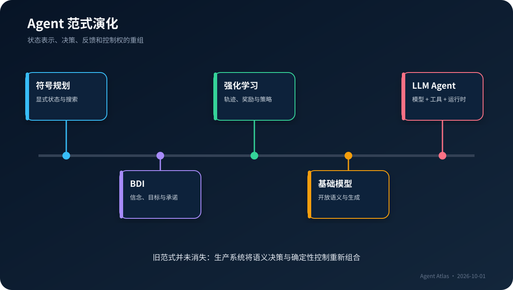
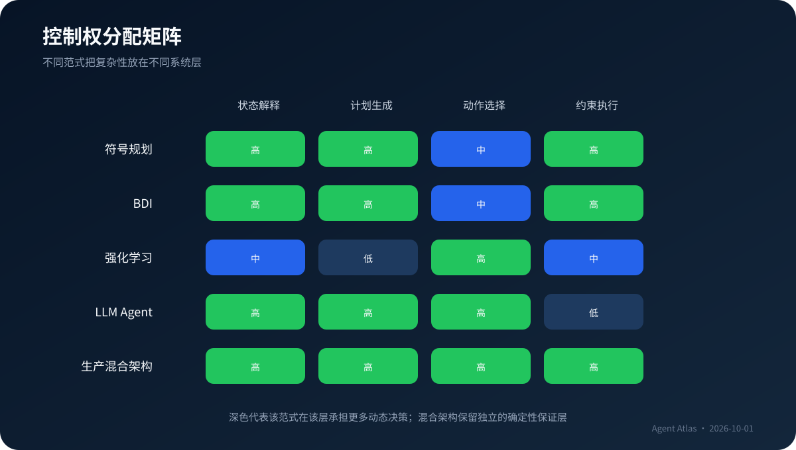

# 从符号主义、BDI、规划和强化学习到 LLM Agent {#sec-paradigm-evolution}

::: {.chapter-synopsis}
今天的 LLM Agent 并没有取消经典智能体问题。它只是把“如何表示世界、如何选择行动、如何从反馈中修正”中的一部分，从显式程序转移到预训练模型。理解这段演化的价值，不是背年代，而是知道每种范式把复杂性放在了哪里。
:::

## 本章要解决的问题

软件行业很容易把 Agent 的历史压缩成一条营销叙事：过去是规则，现在是大模型，未来是自主系统。这条叙事忽略了一个关键事实——智能体从来不是单一算法，而是一种**围绕环境交互组织计算**的方式。规划系统、BDI、行为控制、强化学习与 LLM Agent 对“环境、状态、目标、动作、反馈”的回答不同，却共享同一个工程骨架。

对于资深后端工程师，真正需要建立的是一组可迁移的问题：

1. 系统认为世界状态是什么，谁负责维护它？
2. 目标以逻辑条件、效用函数、奖励还是自然语言表达？
3. 下一步行动由搜索、规则、策略网络还是语言模型决定？
4. 环境反馈如何进入下一轮决策，错误如何被识别？
5. 哪些控制权可以交给概率模型，哪些必须留在确定性系统？

@fig-paradigm-evolution 把演化画成能力重组，而不是线性替代。

{#fig-paradigm-evolution fig-alt="Agent 范式从符号规划、BDI、反应式控制、强化学习、基础模型演进到 LLM Agent 的时间轴与能力变化"}

## 作为起点的“理性智能体”

经典人工智能教材常用理性智能体（rational agent）建立统一视角：智能体接收感知，根据已有知识和目标选择动作，使期望绩效最大化。这个定义刻意不绑定实现。一个温控器、路径规划器、交易系统和使用工具的大模型都可以放进同一框架，区别在于感知空间、动作空间、内部状态和评价标准的复杂度 [@aima-4e]。

这一定义对工程的贡献有三点。

第一，**Agent 是系统边界，不是人格**。它说明哪些输入被视为观察，哪些输出会改变环境，哪些指标决定成功。名称、角色设定和对话语气都不是定义的核心。

第二，**智能体必须处于闭环**。如果模型只生成一次文本，且结果不影响下一步状态，它更像一个函数调用。只要系统会观察工具结果、更新状态并再次选择行动，就进入了智能体问题。

第三，**理性是相对于信息和预算的**。真实系统不拥有完整世界模型，也不能无限搜索。工程目标不是理论上的全知最优，而是在延迟、成本、权限和风险约束下得到可接受结果。

这与后端系统中的控制循环并不陌生。Kubernetes controller 比较期望状态与实际状态，生成调和动作；工作流引擎根据状态推进节点；数据库事务根据约束决定提交或回滚。LLM Agent 的新意，在于部分状态解释和动作选择由概率模型完成，而不是所有控制逻辑都写在程序里。

## 符号规划：把世界写成可搜索的状态空间

早期规划系统把问题表达为初始状态、目标条件和一组带前置条件及效果的动作。STRIPS 代表了这种思路：动作只有在前置条件满足时可用，执行后对世界状态增加或删除若干事实 [@strips-1971]。规划器的任务，是搜索一条从初始状态到目标状态的动作序列。

考虑一个简化的发布变更：

```text
初始状态：代码已合并、测试未通过、生产未发布
目标状态：生产已发布、关键指标正常

动作 run_tests
  前置：代码已合并
  效果：测试通过 或 测试失败

动作 deploy_canary
  前置：测试通过、变更已审批
  效果：金丝雀实例已发布

动作 promote
  前置：金丝雀指标正常
  效果：生产已发布
```

这种表示的优势是可验证。规划器不能凭空跳过审批，也不能在测试失败时合法执行发布。它适合状态有限、动作语义清楚、约束需要形式化保证的环境。

代价同样明显：真实世界很难完整离散化。事故报告中的“风险较低”、需求中的“尽量不影响用户”、文档之间的语义冲突，都不容易变成封闭谓词。状态建模成本会随着领域开放程度迅速增加，计划还可能因环境变化而失效。

工程上不应把符号规划理解为过时技术。现代 Agent 的工具参数校验、状态机、策略规则、前置条件和补偿动作，本质上仍在继承它的强项：**把必须成立的约束写成程序，而不是希望模型记住**。

## BDI：在动态环境中管理承诺

Belief-Desire-Intention（信念—愿望—意图）架构试图解决纯规划系统面对动态环境时的僵化。BDI 中：

- Belief 表示智能体当前认为成立的世界信息；它可能不完整甚至错误。
- Desire 表示潜在目标，多个目标可能同时存在并相互冲突。
- Intention 表示已经承诺执行的目标或计划，避免每次观察变化都从零重算。

Rao 与 Georgeff 的工作把 BDI 的逻辑基础、实用解释器和大型应用联系起来 [@bdi-1995]。它引入了一个至今仍重要的工程主题：**什么时候坚持计划，什么时候重新规划**。

如果系统每收到一次新日志就完全重做计划，会产生抖动和高成本；如果无论环境怎样变化都坚持旧计划，又会把局部失败放大。BDI 用“意图”表达有限承诺：计划不是不可改变，但改变必须有理由。

现代 LLM Agent 中常见的 `plan`、`current_task`、`working_memory` 与 `resume_state`，可以看作 BDI 思想的弱形式。区别在于，经典 BDI 通常依赖显式的信念库、事件规则和计划库，而 LLM 系统可能把它们混在对话历史与自然语言计划中。这种便利也带来风险：

- 信念与原始证据没有分离，摘要错误可能被当成事实。
- 愿望与用户授权没有分离，模型生成的新目标可能越界。
- 意图没有版本和状态，恢复运行时无法判断旧计划是否仍有效。

因此，把 BDI 用在现代工程中，不是给三个字段换英文名，而是把**证据、候选目标、已承诺工作和失效条件**分别持久化。

## 反应式与分层控制：不是所有行动都需要“想很久”

规划强调先构造行动序列，反应式系统强调根据当前感知快速选择行为。机器人控制中常见分层设计：底层负责避障、限速和紧急停止，中层执行局部策略，高层设定任务。低层规则拥有更高的实时性和安全优先级，高层不能任意覆盖。

这条经验对 LLM Agent 极其重要。模型擅长解释非结构化信息和生成候选方案，却不应该接管所有快速控制：

- 请求限流应由网关执行，而不是提示模型“不要太频繁”。
- 文件系统和网络访问应由沙箱限制，而不是要求模型自律。
- 支付上限、审批状态、租户隔离应由策略引擎判断。
- 超时、最大步数、并发额度和熔断应由运行时执行。

LLM 位于高层决策，不意味着低层控制消失。相反，模型越能发起真实动作，确定性控制面越重要。

## 强化学习：从给定计划转向从交互中学习策略

强化学习把智能体与环境的交互表示为状态、动作、奖励和状态转移。智能体的目标不是找到一条人工给出的规则链，而是学习一个策略，使长期累计回报最大化 [@sutton-barto-2018]。

这带来三项范式变化。

其一，目标从逻辑谓词变成数值反馈。系统可以在不知道最佳动作序列的情况下，根据成功、失败和中间奖励改进策略。

其二，探索成为问题的一部分。智能体必须在利用已知好动作与尝试未知动作之间权衡。生产软件通常不允许在真实用户上任意探索，因此训练环境、模拟器和离线数据成为关键基础设施。

其三，信用分配变得困难。一个长任务最终失败，究竟是哪个早期动作造成的？如果奖励只在最后出现，学习信号会很稀疏；如果人为设计大量中间奖励，又可能诱导系统优化代理指标而偏离真实目标。

LLM Agent 与强化学习的关系经常被混淆。一个使用工具的 LLM 运行时并不会因为多轮调用自动“学习”。如果模型参数不更新、策略不从数据中改变，它只是在推理时适应上下文。记忆写入可以改变后续输入，但也不等同于策略学习。第 24 章会进一步讨论 Agentic RL 的环境、轨迹、验证器和奖励设计。

## 基础模型：状态不再完全依赖人工建模

Transformer 架构让模型能够在大规模序列上学习上下文关系 [@transformer-2017]。随后，指令微调、偏好优化、上下文学习和推理提示，使语言模型逐渐具备把自然语言任务映射为中间步骤与结构化输出的能力。Chain-of-Thought 研究展示了通过中间推理样例改善复杂任务表现的现象 [@cot-2022]，但工程系统不应把模型的私有推理文本当作稳定 API 或审计依据。

基础模型改变 Agent 工程的关键，不是“模型会聊天”，而是它降低了三类建模成本：

1. **语义状态提取**：从文档、工单、网页和对话中抽取与任务有关的信息。
2. **开放动作选择**：在自然语言描述的工具集合中选择能力并生成参数。
3. **弱结构规划**：面对未见过的组合任务，生成可修改的候选步骤。

过去必须由领域专家枚举的大量状态和规则，现在可以由模型在运行时解释。但成本并没有消失，而是从“完整编码世界模型”转移到：上下文选择、工具设计、结果验证、权限控制、评测数据和运行时恢复。

## ReAct 与工具使用：语言推理进入环境闭环

ReAct 把推理与行动交错起来：模型根据当前任务产生行动，环境返回观察，模型再据此更新后续计划 [@react-2023]。Toolformer 则研究模型学习何时调用 API、传什么参数以及怎样利用结果 [@toolformer-2023]。二者共同推动了现代 LLM Agent 的基本形态：

```text
目标 + 当前状态
      ↓
模型选择下一动作
      ↓
运行时验证与执行工具
      ↓
观察结果进入状态
      ↓
继续、完成、失败、等待审批或求助
```

这个循环看似简单，却重新打开了经典 Agent 的全部问题：状态是否真实、动作是否合法、观察是否可信、计划是否过时、奖励是否合理、何时应该停止。LLM 提供了强大的语义策略，但没有替代运行时。

Anthropic 将 workflow 与 agent 区分为两类控制方式：前者由程序预定义路径，后者让模型动态决定过程与工具；其建议也是从简单组合逐步增加自主性 [@anthropic-effective-agents]。工程上更准确的理解是一个连续谱，而不是二选一。

## 控制权如何在系统中重新分配

@fig-control-allocation 展示五种范式中，状态解释、计划、动作选择和约束执行的大致归属。

{#fig-control-allocation fig-alt="符号规划、BDI、强化学习、LLM Agent 和生产级混合架构的控制权分配矩阵"}

| 范式 | 状态表示 | 决策来源 | 反馈方式 | 主要强项 | 主要代价 |
|---|---|---|---|---|---|
| 符号规划 | 显式事实与谓词 | 搜索与逻辑规则 | 重新规划 | 可解释、约束清楚 | 建模成本高，开放环境脆弱 |
| BDI | 信念、目标、意图 | 事件与计划库 | 更新信念、撤销意图 | 适合动态目标和有限承诺 | 计划库维护复杂 |
| 反应式控制 | 当前感知与局部状态 | 优先级规则/策略 | 高频闭环 | 低延迟、安全边界清晰 | 缺少长程推理 |
| 强化学习 | 状态或观测向量 | 学习到的策略 | 奖励与轨迹 | 可从交互优化行为 | 奖励、探索和验证困难 |
| LLM Agent | 上下文、外部状态与自然语言 | 预训练模型的条件生成 | 工具观察与上下文更新 | 开放任务泛化、低语义建模成本 | 概率错误、成本、权限与评测复杂 |

生产系统通常采用混合架构：模型负责解释模糊目标、选择语义动作和生成候选方案；工作流负责业务阶段；状态机负责持久化和恢复；策略引擎负责权限；沙箱负责执行隔离；评测系统负责判断改动是否真的更好。

## 贯穿案例：变更决策系统的五次演化

假设平台团队要建设一个“依赖升级评估助手”。输入是一条升级请求，例如“将订单服务的数据库驱动升级到新主版本”，输出是证据充分、可供评审的变更方案。

### 第一版：规则与模板

程序固定读取服务目录、依赖清单和变更模板。优点是行为稳定；缺点是无法理解非结构化 ADR、事故复盘和供应商公告。它不是失败的 Agent，而是一个合适的 workflow 基线。没有这条基线，团队无法证明引入模型后收益来自哪里。

### 第二版：符号约束

团队把必须满足的发布条件写成规则：高风险依赖必须有回滚方案；涉及数据格式变化必须完成兼容验证；关键服务必须灰度。模型可以生成分析，但规则引擎拒绝不满足前置条件的方案。这继承了规划系统的可验证性。

### 第三版：BDI 式运行状态

系统分开保存证据、候选目标和已批准计划。新事故记录到来时，系统更新信念并判断当前计划是否失效，而不是把整段对话重新交给模型。计划变更会留下版本和原因。

### 第四版：检索增强的 LLM Agent

模型从 RFC、ADR、事故记录和依赖公告中选择检索工具，归纳兼容风险，发现缺失信息并请求补充。它可以应对过去没有写过规则的新组合问题，但仍只能调用只读工具和“生成草案”工具。

### 第五版：评测驱动的混合系统

团队收集历史变更作为测试集，检查证据召回、风险覆盖、错误引用、工具参数、审批状态和最终方案。模型升级只在离线评测和影子运行通过后发布。此时，Agent 不再是一个 prompt，而是一套带状态、工具、策略、数据和运营流程的产品系统。

## 架构选择：从最小不确定性开始

一个实用原则是：**只把无法经济地预先编码、且能够被评测的判断交给模型**。

| 问题特征 | 首选方式 | 升级为 Agent 的信号 |
|---|---|---|
| 步骤固定、规则清楚 | 普通程序或 workflow | 输入变化导致分支数量不可维护 |
| 目标固定、环境动态 | 状态机 + 局部策略 | 需要根据非结构化观察调整计划 |
| 语义判断多、动作少 | 单次模型调用 + 校验 | 必须根据工具结果多轮修正 |
| 步数不可预知、可安全试错 | 有界单 Agent | 单一上下文或工具集合已成为瓶颈 |
| 多个独立领域可并行 | 编排器 + 专家 Agent | 并行收益大于协调与验证成本 |

不要从“最多能有多自主”出发，而要从“哪一处不确定性值得动态化”出发。每增加一层自主性，都应有对应的观测、预算、失败处理和回退路径。

## 常见误区与失败模式

### 误区一：把会调用函数等同于 Agent

一次结构化函数调用可能只是增强型模型调用。是否构成 Agent，取决于系统是否在环境反馈后继续决策，以及谁掌握终止和控制路径。命名不会改变架构。

### 误区二：把自然语言计划当成真实状态

模型写下“测试已通过”不等于测试系统真的通过。事实必须来自受信工具或权威数据源；模型输出应标注为主张、建议或待验证项。

### 误区三：把长期记忆当成持续学习

写入向量库会改变后续上下文，不会自动改变模型策略。未经治理的记忆还会固化错误、越权信息和注入内容。

### 误区四：用多 Agent 掩盖单体设计问题

如果任务边界、工具契约和成功标准都不清楚，增加角色只会复制模糊性。多 Agent 需要明确的所有权、消息契约、共享状态与冲突解决机制。

### 误区五：用提示词承担强约束

提示词适合表达任务与软约束，不适合实现租户隔离、金额上限、网络边界或不可逆动作审批。模型可以提出动作，系统必须独立决定动作是否允许。

## 生产决策清单

- [ ] 是否存在不使用 Agent 的确定性基线？
- [ ] 目标、成功条件和不可接受结果是否明确？
- [ ] 状态中的事实、推断、计划和授权是否分开？
- [ ] 模型可以选择哪些动作，哪些动作永远不能选择？
- [ ] 每个动作是否有前置条件、超时、幂等与错误语义？
- [ ] 运行是否有步数、时间、令牌、费用和并发预算？
- [ ] 环境观察是否可能包含恶意指令或陈旧数据？
- [ ] 何时重新规划、何时坚持计划、何时请求人工判断？
- [ ] 是否记录足够轨迹以复现失败，而不依赖隐藏推理？
- [ ] 新方案是否通过同一数据集与基线比较？

## 本章小结

Agent 的历史不是从“笨规则”走向“万能模型”的直线。符号规划贡献了显式状态和约束，BDI 贡献了动态环境中的目标与承诺管理，反应式控制贡献了分层边界，强化学习贡献了从交互轨迹优化策略的视角，基础模型则显著降低了开放语义建模和动作选择的成本。

现代 Agent 的正确工程形态通常是组合：让模型处理语义不确定性，让程序处理权限、状态、预算和验证。理解历史的最终目的，是知道哪些旧问题仍然存在，以及应该把它们放回哪一层系统。

## 思考与实践

1. 选择你维护过的一条复杂业务流程，分别用规划、BDI 和 LLM Agent 的术语描述其状态、目标和动作。哪些部分其实早已是 Agent 问题？
2. 找出该流程中最难编码的一个语义判断，并设计一个只动态化这一点的最小方案。
3. 为“重新规划”写出三个明确触发条件，并说明怎样避免频繁抖动。
4. 运行实验 `01-auditable-loop`，修改预算或 Fake Model 决策，观察运行时如何保持终止权。
